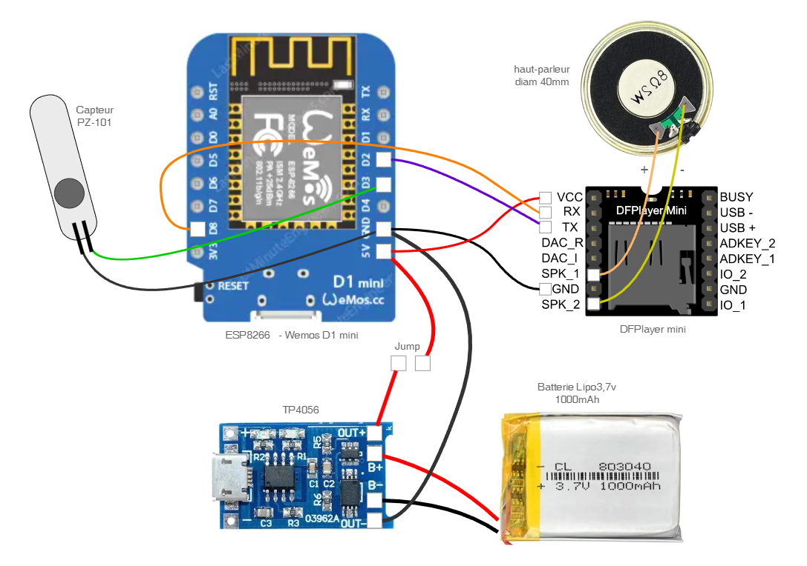

## [ Projet DIY ] " La Boite à M ... "  ... Meeuuuuhh !!! ... ou boite à autre chose ... 

<table  width="100%"><tbody>
<tr>
<td align="center" width="49%"></td>

<td align="center" width="24%">(merci Magalie)</td>
<td align="center" width="24%">(merci Cécille)</td>

</tr>
</tbody></table>  

---

### ***Description***

Cette petite boite est très simple !!  
Elle est réalisée en impression 3D, embarque un petit peu d'électronique, et sa programmation est plutôt facile  
 
Cette "boîte à meuh", aussi nommée "boîte à vache", est un projet DIY (Do it yourself - faites-le par vous-même). Elle respecte les dimensions de la boite originale des années 80 ( https://fr.wikipedia.org/wiki/Bo%C3%AEte_%C3%A0_meuh )
 

Au programme dans ce tuto, et en images & vidéos :

* les pièces 3D et l'impression
* la liste des composants et le schéma électronique
* l’implantation des composants sur une petite carte d'essai
* l'assemblage final
* un exemple de programme

---
### ***Impression 3D***

Le projet est composé de :

* 2 pièces pour la boite ( [boite.stl](STL/boite.stl) ) et pour son couvercle ( [couvercle.stl](STL/couvercle.stl) )
* 2 pièces pour le support du circuit imprimé et de la batterie : [support_ci_1.stl](STL/support_ci_1.stl) et [support_ci_2.stl](STL/support_ci_2.stl)

<table width="100%">
<td align="center"></td>
<td align="center"></td>
</table>

* Pas de recommendation particulière pour l'impression, PLA ou PETG .... il faut juste une impression propre, soigné, sans précipitation  
* La précision de l'impression contribuera au bon fonctionnement du pas de vis entre la boite et son couvercle. 

* /!\ A noter /!\ : l’emboîtement des deux pièces intérieures ( pour le support du CI ) se fait "à force" : impossible de déboîter sans casser  
==> il faut donc insérer le circuit imprimé avant l’emboîtement final des deux pièces

<table width="100%">
<td align="center"></td>
<td align="center"></td>
</table>

---
### ***Électronique - composants et schéma***

Le projet est composé des pièces suivantes :

* un module ESP8266 au format Wemos D1 Mini
* un module lecteur MP3 DFPlayer
* une petite carte Micro SD pour le stockage du DFPlayer
* un petit haut-parleur 2w 8Ohms d'un diamètre de 40mm
* un capteur / interrupteur PZ-101 , détecteur d'inclinaison
* une batterie LiPo 3,7V 1000mAh
* un module de gestion charge type TP4056
* un petit "jump" coupe circuit (en guise d'interrupteur marche/arrêt)

*Raccordement de l'ESP8266 :* 
* D3 --> capteur d'inclinaison PZ-101
* D2 --> DFPlayer TX
* D8 --> DFPlayer RX

---
### ***Électronique - Implantation***

L'implantation est réalisé sur une plaque d'éssai ( circuit imprimé à trous prés étamés ) qu'il faudra découper aux dimentions : 50 x 33 mm  
--> Le module DFPlayer et le module de gestion de charge, sont placés en dessous de l'ESP8266  
--> L'ESP8266 est monté sur deux barrettes au pas de 2.54mm , afin de rester enfichables, et d'être sur élevé   
--> Le capteur/interrupteur est soudé directement sur l'ESP8266  
--> Le haut-parleur est collé sur la pièce 3D précédemment imprimer  
 
L'implantation et le câblage ne sont pas strictes et peuvent être réalisés de différentes façons ...

<table width="100%">
<td align="center"></td>
<td align="center"></td>
<td align="center"></td>
<td align="center"></td>

</table>

<table width="100%">
<td align="center"></td>
<td align="center"></td>
</table>

---
### ***Assemblage final***

Il reste à insérer le montage électronique dans son support  
--> Les fils de la batterie passent par un petit trou, il faut donc souder la batterie au dernier moment  

<table width="100%">
<td align="center"></td>
<td align="center"></td>
<td align="center"></td>
<td align="center"></td>
</table>

En vidéo pour mieux visualiser l'assemblage du projet , ici :

* https://youtube.com/shorts/o-fcbijORVw
* https://youtube.com/shorts/FD-gXw5TFGc

---
### ***Programmation***

[Exemple de programmation](code/01_Projet_Boite_a_M.ino)

