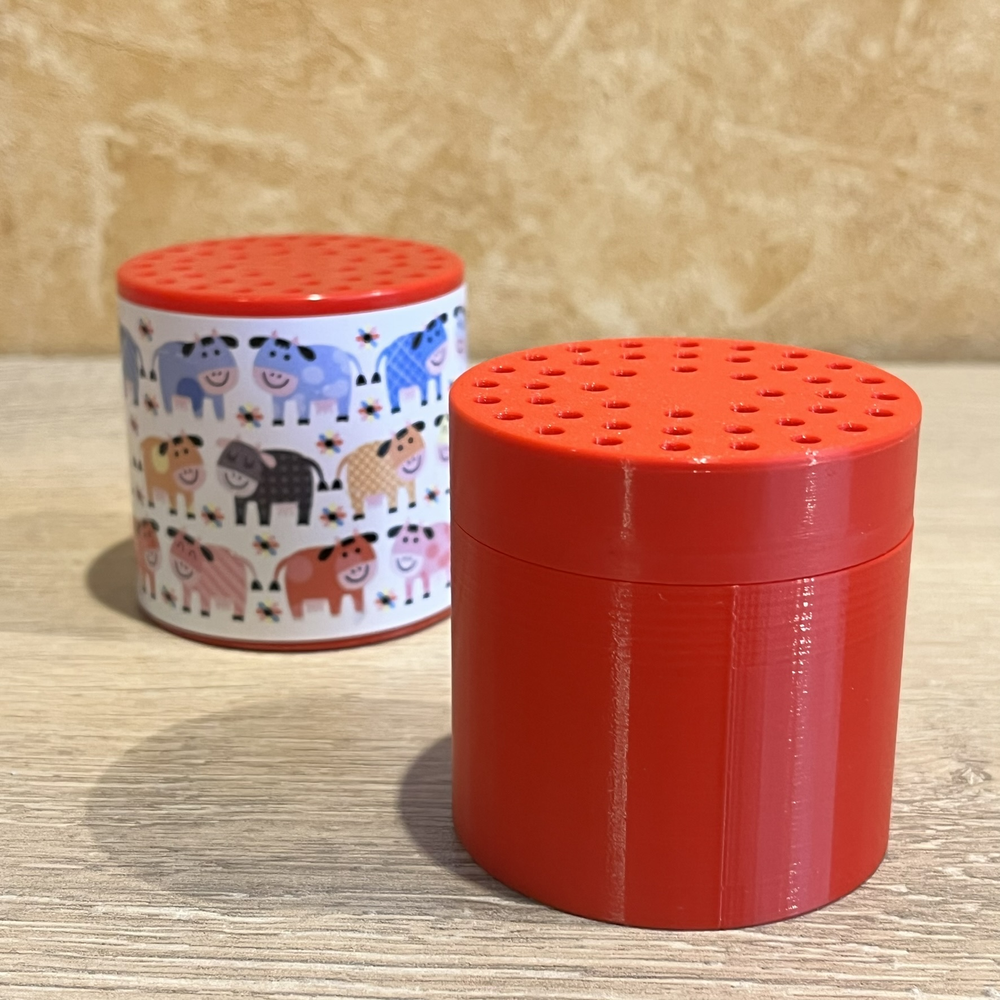
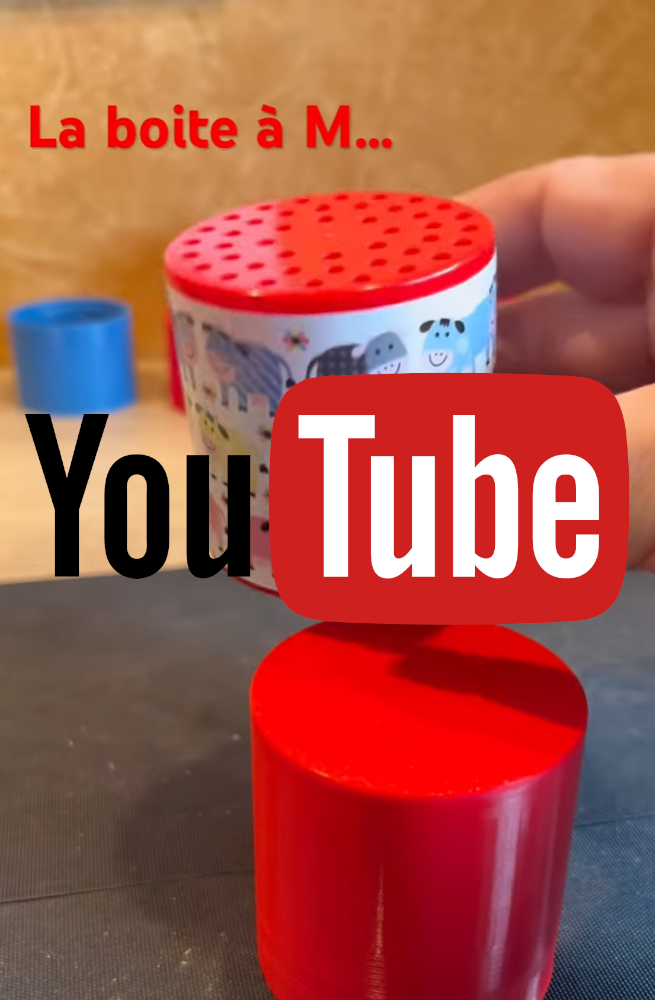

## [ Projet DIY ] " La Boite à M ... "  ... Meeuuuuhh !!! ... ou boite à autre chose ... 

<table  width="100%"><tbody>
<tr>
<td align="center" width="49%"></td>

<td align="center" width="24%"></td>
<td align="center" width="24%"></td>

</tr>
</tbody></table>  

---

### ***Description***

Cette petite boite est très simple !!  
Elle est réalisée en impression 3D et embarque un petit peu d'électronique, sa programmation est facile  

Au programme dans ce tuto en images et vidéos :

* les pièces 3D et l'impression
* la liste des composants et le schéma électronique
* l'implentation des composants sur une petite carte d'essai
* l'assemblage final
* un exemple de programme

---
### ***Impression 3D***

Le projet est composé de :

* 2 pièces pour la boite ( [boite.stl](STL/boite.stl) ) et pour son couvercle ( [couvercle.stl](STL/couvercle.stl) )
* 2 pièces pour le support du circuit imprimé et de la batterie : [support_ci_1.stl](STL/support_ci_1.stl) et [support_ci_2.stl](STL/support_ci_2.stl)

<table width="100%">
<td align="center"></td>
<td align="center"></td>
</table>

* Pas de recommendation particulière pour l'impression, PLA ou PETG .... il faut juste une impression propre, soigné, sans précipitation  
* La précision de l'impression contribuera au bon fonctionnement du pas de vis entre la boite et son couvercle. 

* /!\ A noter /!\ : l’emboîtement des deux pièces intérieures ( pour le support du CI ) ce fait "à force" : impossible de déboîter sans casser  
==> il faut donc insérer le circuit imprimé avant l’emboîtement finale des deux pièces

<table width="100%">
<td align="center"></td>
<td align="center"></td>
</table>

---
### ***Électronique - composants et schéma***

Le porjet est composé des pièces suivantes :

* un module ESP8266 au format Wemos D1 Mini
* un module lecteur MP3 DFPlayer
* un petit haut-parleur 2w 8Ohms d'un diameètre de 40mm
* un capteur / interrupteur PZ-101 , détecteur d'inclinaison
* une batterie LiPo 3,7V 1000mAh
* un module de gestion charge type TP4056

---
### ***Électronique - Implantation***

L'implentation est réalisé sur plaque d'éssai ( circuit imprimé à trous prés étamés ) qu'il faudra découper aux dimentions : 50 x 33 mm

<table width="100%">
<td align="center"></td>
<td align="center"></td>
<td align="center"></td>
<td align="center"></td>

</table>

<table width="100%">
<td align="center"></td>
<td align="center"></td>
</table>

---
### ***Assemblage final***

<table width="100%">
<td align="center"></td>
<td align="center"></td>
<td align="center"></td>
<td align="center"></td>
</table>

En vidéo, ici :

* https://youtube.com/shorts/o-fcbijORVw
* https://youtube.com/shorts/FD-gXw5TFGc

---
### ***Programmation***

[Exemple de programmation](code/01_Projet_Boite_a_M.ino)

